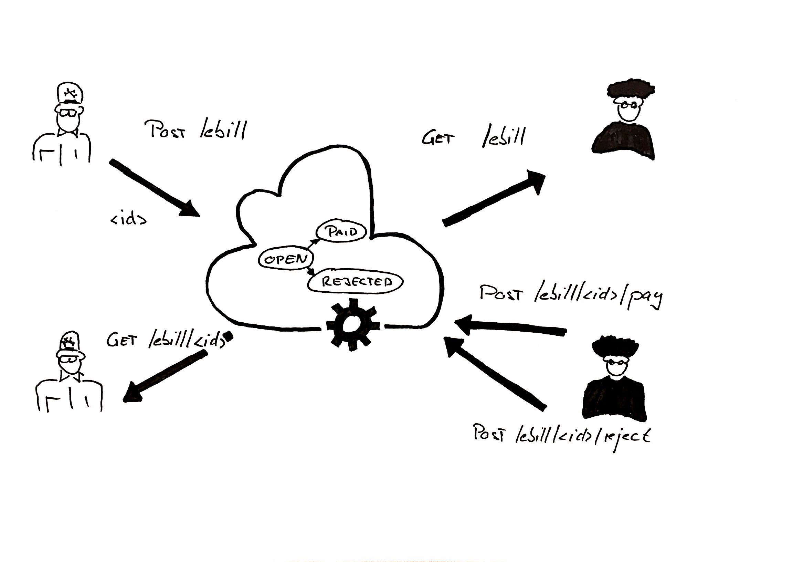

# ebill infrastructure sample mock

## Disclaimer
This mock is a simplified version of a hypothetical future ebill infrastructure api. At the moment, nothing like this exists. 

The mock shall provide a basis to play around and develop independent new ideas in the area of digitalization of payments. Feel free to adjust the mock for your needs!

## Getting Started

Download and Install NodeJS 6.x and NPM

https://nodejs.org/en/

Extract Zip-File and run npm to install dependencies

`npm install`

Start server
 
`node server.js`

## API
Overview


Submit ebill

`POST http://localhost:3000/ebill`

Query all ebills

`GET http://localhost:3000/ebill`

Query specific ebill

`GET http://localhost:3000/ebill/<id>`

Pay

`POST http://localhost:3000/ebill/<id>/pay`

Reject

`POST http://localhost:3000/ebill/<id>/reject`

## Examples

### Submit ebill
*request*

```
POST /ebill HTTP/1.1
Host: localhost:3000
Content-Type: application/json
Cache-Control: no-cache
Postman-Token: c59ad6c0-ebd4-46ef-9d01-044315274173

{
  "senderIdentification" : "billy@autogarage.com",
  "receiverBankAccount" : "CH93 0076 2011 6238 5295 7",
  "text" : "car service",
  "amount" : 987.65,
  "currency" : "CHF",
  "dueDate" : "2017-04-30"
}
```

*response*
```
{
  "uuid": "51cf717e-b816-452a-be40-2b1d001a1719"
}
```

### Query all ebills
*request*
```
GET /ebill HTTP/1.1
Host: localhost:3000
Content-Type: application/json
Cache-Control: no-cache
Postman-Token: ab7eba65-7d61-fece-31e8-cb3f8e846ae1
```

*response*
```
[
  {
    "senderIdentification": "billy@autogarage.com",
    "receiverBankAccount": "CH93 0076 2011 6238 5295 7",
    "text": "car service",
    "amount": 987.65,
    "currency": "CHF",
    "dueDate": "2017-04-30",
    "uuid": "60adefc1-a7c0-4a13-b915-9f53c61731a9",
    "status": "open"
  },
  {
    "senderIdentification": "billy@autogarage.com",
    "receiverBankAccount": "CH93 0076 2011 6238 5295 7",
    "text": "car service",
    "amount": 987.65,
    "currency": "CHF",
    "dueDate": "2017-04-30",
    "uuid": "51cf717e-b816-452a-be40-2b1d001a1719",
    "status": "open"
  }
]
```

### Query specific ebill
*request*
```
GET /ebill/60adefc1-a7c0-4a13-b915-9f53c61731a9 HTTP/1.1
Host: localhost:3000
Content-Type: application/json
Cache-Control: no-cache
Postman-Token: 81e91e04-4593-2da3-abfd-922aab3cc79f
```

*response*
```
{
  "senderIdentification": "billy@autogarage.com",
  "receiverBankAccount": "CH93 0076 2011 6238 5295 7",
  "text": "car service",
  "amount": 987.65,
  "currency": "CHF",
  "dueDate": "2017-04-30",
  "uuid": "60adefc1-a7c0-4a13-b915-9f53c61731a9",
  "status": "open"
}
```


### pay
*request*
```
POST /ebill/60adefc1-a7c0-4a13-b915-9f53c61731a9/pay HTTP/1.1
Host: localhost:3000
Content-Type: application/json
Cache-Control: no-cache
Postman-Token: 65635c7d-aa29-b8c9-15b4-9ec913bf5bfa

{
  "senderIdentification" : "billy@autogarage.com",
  "receiverBankAccount" : "CH93 0076 2011 6238 5295 7",
  "text" : "car service",
  "amount" : 987.65,
  "currency" : "CHF",
  "dueDate" : "2017-04-30"
}
```

*response*
```
{
  "senderIdentification": "billy@autogarage.com",
  "receiverBankAccount": "CH93 0076 2011 6238 5295 7",
  "text": "car service",
  "amount": 987.65,
  "currency": "CHF",
  "dueDate": "2017-04-30",
  "uuid": "60adefc1-a7c0-4a13-b915-9f53c61731a9",
  "status": "paid"
}
```

*reject*
```
POST /ebill/51cf717e-b816-452a-be40-2b1d001a1719/reject HTTP/1.1
Host: localhost:3000
Content-Type: application/json
Cache-Control: no-cache
Postman-Token: 170a936c-f9b5-b0df-a01e-caabb3fa98cf

{
  "senderIdentification" : "billy@autogarage.com",
  "receiverBankAccount" : "CH93 0076 2011 6238 5295 7",
  "text" : "car service",
  "amount" : 987.65,
  "currency" : "CHF",
  "dueDate" : "2017-04-30"
}
```

*response*
```
{
  "senderIdentification": "billy@autogarage.com",
  "receiverBankAccount": "CH93 0076 2011 6238 5295 7",
  "text": "car service",
  "amount": 987.65,
  "currency": "CHF",
  "dueDate": "2017-04-30",
  "uuid": "51cf717e-b816-452a-be40-2b1d001a1719",
  "status": "rejected"
}
```